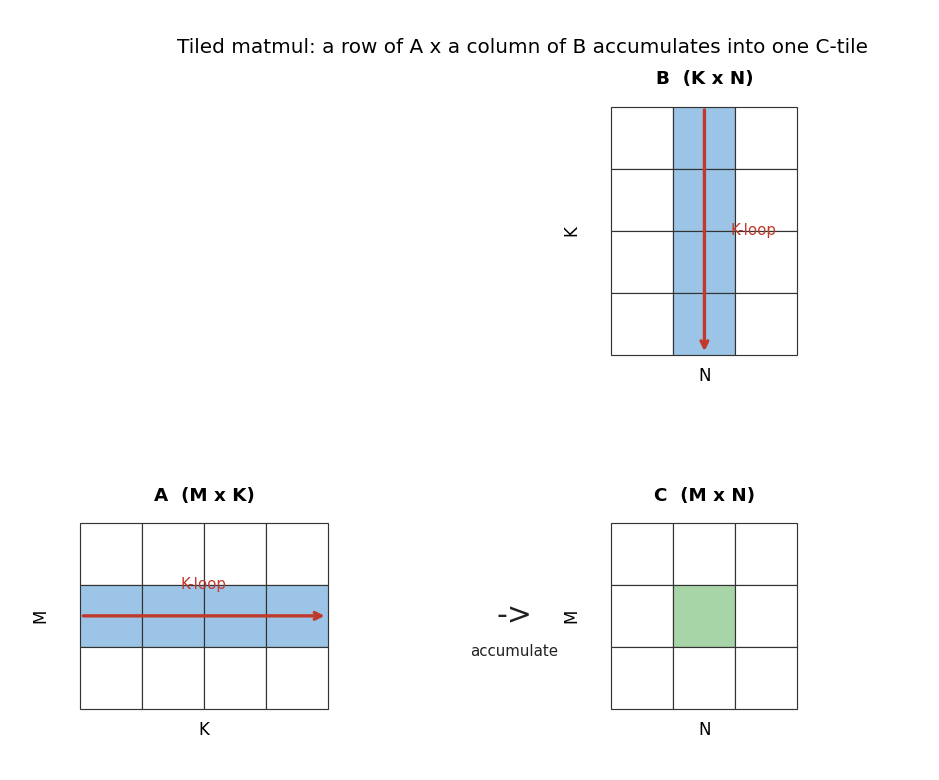

<!-- README.md -->

# Write Your First High-Performance GPU Kernel in Python!

<p align="center">
  
</p>

**PyCon Italy 2026 · Bologna · May 27–30, 2026**
Speaker: [Abhik Sarkar](https://www.abhik.ai) · [Session page](https://2026.pycon.it/profile/bxlreb)

A 120-minute hands-on workshop. You walk in fluent in NumPy and PyTorch. You walk out with your own tiled matrix-multiplication kernel running on a GPU — correctness-tested against `torch.matmul`, benchmarked, and **roughly 100,000× faster than the equivalent naive Python loop**.

No prior CUDA. No prior GPU programming. Just Python.

---

## Prerequisites

**Required:** comfortable Python (closures, decorators, comprehensions), NumPy fluency (indexing, broadcasting, dtypes), basic PyTorch (tensors, `.to(device)`, `torch.matmul`), and a Google account for Colab.

**Not required:** any CUDA/OpenCL/GPU experience, deep-learning theory, or your own GPU — the workshop runs entirely on Colab's free T4.

---

## Before the workshop (15 minutes)

1. Open [`pre-work/00-hello-gpu.ipynb`](pre-work/00-hello-gpu.ipynb) in Google Colab.
2. Set the runtime to **T4 GPU**: _Runtime → Change runtime type → T4 GPU_.
3. _Runtime → Run all_.
4. _File → Save a copy in Drive_ so it survives a disconnect.

You're ready when the last cell prints `✓ All checks passed. See you in Bologna.` If anything fails, **reply to the pre-work email** — we'll sort it out before the room is full.

---

## The notebooks

Five notebooks, each adding exactly one new GPU primitive on top of the last. The boilerplate is written — imports, input data, reference output, correctness check, timing harness. You fill in the kernel body, marked by numbered `# TODO (N/M):` blocks. **18 TODOs** across the four attendee notebooks.

| # | Notebook | Format | What's new |
|---|----------|--------|------------|
| 01 | [`01-vector-add-cupy-raw`](notebooks/01-vector-add-cupy-raw.ipynb) | Speaker demo | What a GPU kernel actually is: CUDA C in a Python string, JIT-compiled and launched. |
| 02 | [`02-vector-add-triton`](notebooks/02-vector-add-triton.ipynb) | 3 TODOs | Your first Triton kernel. `program_id`, `tl.arange`, masks. |
| 03 | [`03-reduction-triton`](notebooks/03-reduction-triton.ipynb) | 4 TODOs | Parallel sum. `tl.sum`, single-block core + multi-block bonus. |
| 04 | [`04-image-blur-triton`](notebooks/04-image-blur-triton.ipynb) | 5 TODOs | Fused softmax in one kernel (beat the memory wall), then a 1D blur worked example + a 2D halo bonus. |
| 05 | [`05-tiled-matmul-triton`](notebooks/05-tiled-matmul-triton.ipynb) | 6 TODOs | **The capstone.** Tiling + `tl.dot`, benchmarked against `torch.matmul`. |

Solutions land on the `main` branch after the session. The standalone benchmark is already here — run `python -m bench.compare_vs_torch` to compare the naive Python loop, NumPy, the Triton kernel, and `torch.matmul`.

<details>
<summary><b>Schedule (120 min · WATCH → WRITE → MEASURE → CLIMB)</b></summary>

The session breaks into four themed quadrants. The mid-workshop roofline detour sits between nb03 and nb04 — where attendees first see "% of T4 peak" on their own kernels and learn why nb04/nb05 are about climbing the diagonal.

| Quadrant | Block | Min | What |
|----------|-------|-----|------|
| **Q1 · WATCH** *(25)* | Setup + intro | 5 | T4 runtime check, repo open |
| | Part 1 slides | 9 | intro + 7-slide GPU model |
| | nb01 vector add (CuPy demo) | 11 | speaker demo, no TODOs; what a kernel actually is |
| **Q2 · WRITE** *(30)* | Part 2 slides | 5 | the Triton recipe, TODOs |
| | nb02 vector add (Triton) | 12 | 3 TODOs; print effective GB/s vs T4 peak |
| | nb03 reduction | 13 | 4 TODOs; print effective GB/s vs T4 peak |
| **Q3 · MEASURE** *(28)* | Part 3 slides | 10 | roofline + memory wall |
| | nb04 softmax + blur | 18 | 5 TODOs; fused softmax beats the memory wall, halo blur bonus |
| **Q4 · CLIMB** *(37)* | Part 4 slides | 5 | tile, recipe, what good is |
| | nb05 tiled matmul | 27 | 6 TODOs (capstone); arithmetic intensity + % of T4 peak FP32 |
| | Wrap + Q&A | 5 | closing roofline read, take-homes |
| **Total** | | **120** | |

</details>

<details>
<summary><b>If something goes wrong on the day</b></summary>

- **"No CUDA GPU detected"** — _Runtime → Change runtime type → T4 GPU_, then _Runtime → Restart and run all_.
- **Triton or CuPy import fails** — re-run the bootstrap cell at the top of the notebook; it installs anything missing.
- **Colab disconnects mid-workshop** — your saved copy in Drive is still there; reconnect and pick up where you left off.
- **Kernel compile error** — read the line Triton points at. Nine times in ten it's a missing `mask=` argument or a typo in an offset expression.
- **Correctness check fails** — re-read the TODO comments above the failing block. The reference output and shape are right there in the notebook.

</details>

---

## Running locally instead of Colab

Colab is the supported path. Local is best-effort and Linux-only — see [`env-setup.md`](env-setup.md) for prerequisites (NVIDIA driver ≥ 535, CUDA 12, Python ≥ 3.10).

```bash
git clone https://github.com/abhiksark/pycon-italy-2026-workshop.git
cd pycon-italy-2026-workshop
python3 -m venv .venv && source .venv/bin/activate
pip install -r requirements.txt
jupyter notebook notebooks/02-vector-add-triton.ipynb
```

Run `pytest` (CPU-only, no GPU) to exercise the timing helper, the benchmark harness, and the notebook asset embedding.

---

## License

Workshop materials are MIT-licensed — see [`LICENSE`](LICENSE).
